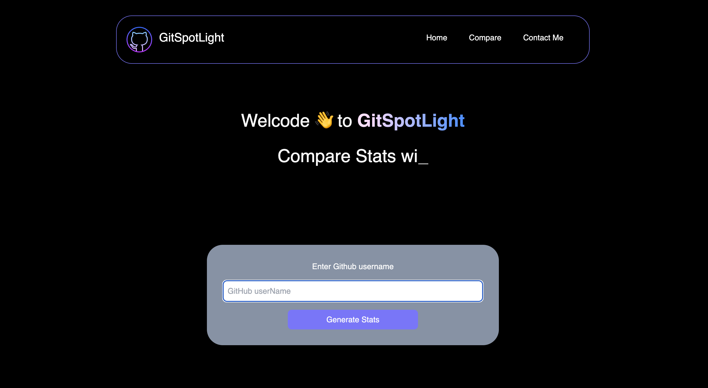
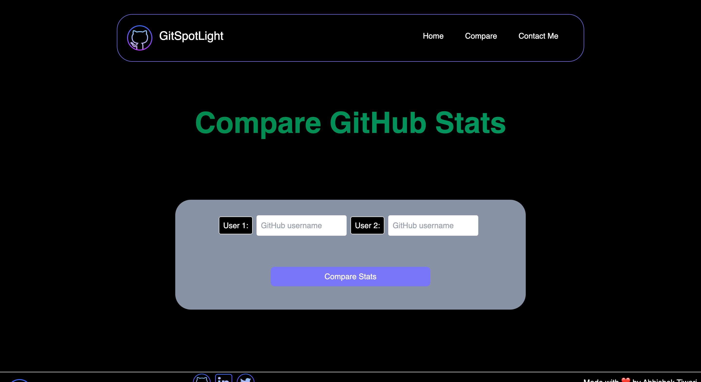
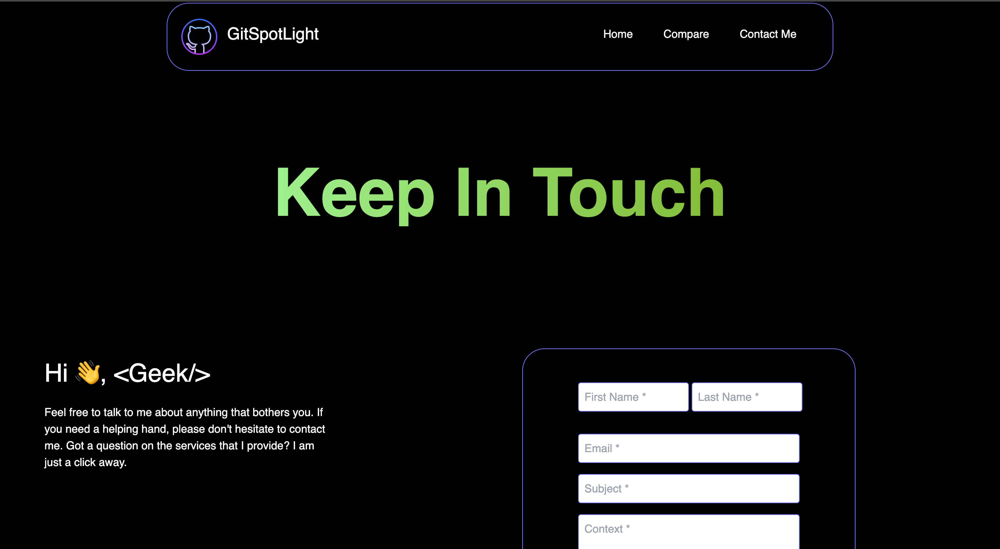

# GitSpotLight 🐙

 The application is built using Next.js, Tailwind CSS, and the GitHub API. It also features a contact form using Nodemailer for users to reach out to the developer.

## Problem It Solves

- ### Developer productivity and motivation
    - GitSpotLight help the developers to stay motivated and check their progress, they can also compare with friends and others
- ### Hiring and talent acquisition
    - Employers could quickly get an overview of the candidate's experience, skill level, and areas of expertise.
- ### Open-source project management
    - Help maintainers to identify top contributors and allocate resources accordingly.

## Features

- Get GitHub statistics for a user based on their GitHub userName.
- Compare the GitHub statistics of two users based on their GitHub userName.
- View user details such as their name, email, blog, and profile picture.
- View user activity such as their most recent commits and pull requests.
- Option to view user's GitHub contributions chart.
- Option to view user's repository commit history chart.
- Responsive UI design.
- Built with Next.js and Tailwind CSS
- Utilizes the GitHub API
- Contact form using Nodemailer for users to reach out to the developer

## Current Available Features

- Github Stats Using Github UserName
- Stats Explanation Using Charts

## UpComing Features

- Compare GitHub Stats
- Share Button
- Download Github Stats Report

## Future Idea

- Contribution Stats for Large Codebases
- Hiring Solution

## Images

- User Stats Page (Home)
    

- Compare Page
    
    
- ContactUs Page
    
    
## Phase 1 Video-Clip ( Still Working)
    

## Getting Started

To get started with GitSpotLight, follow these steps:

- Clone this repository to your local machine.
- Install the necessary dependencies by running `npm install`.
- Start the application by running npm run dev.
- Navigate to http://localhost:3000 in your browser to use the application.

## Contributing

Contributions are always welcome! If you would like to contribute to the project, please follow these steps:

- Fork the repository.
- Create a new branch for your changes.
- Make your changes and commit them with a descriptive commit message.
- Push your changes to your forked repository.
- Create a pull request and describe your changes in detail.

## Credits

- [GitHub API](https://docs.github.com/en/rest)
- [Next.js](https://nextjs.org/docs/getting-started)
- [TailwindCss](https://tailwindcss.com/docs/installation)
- [Chart.Js](https://www.chartjs.org/docs/latest/)
- [Work Flow](./workFlow.md)

## Contact
- If you have any questions about GitSpotLight or would like to reach out to the developer, please use the contact form provided in the application or email me directly at tiwari.abhishektiwari23@gmail.com.
